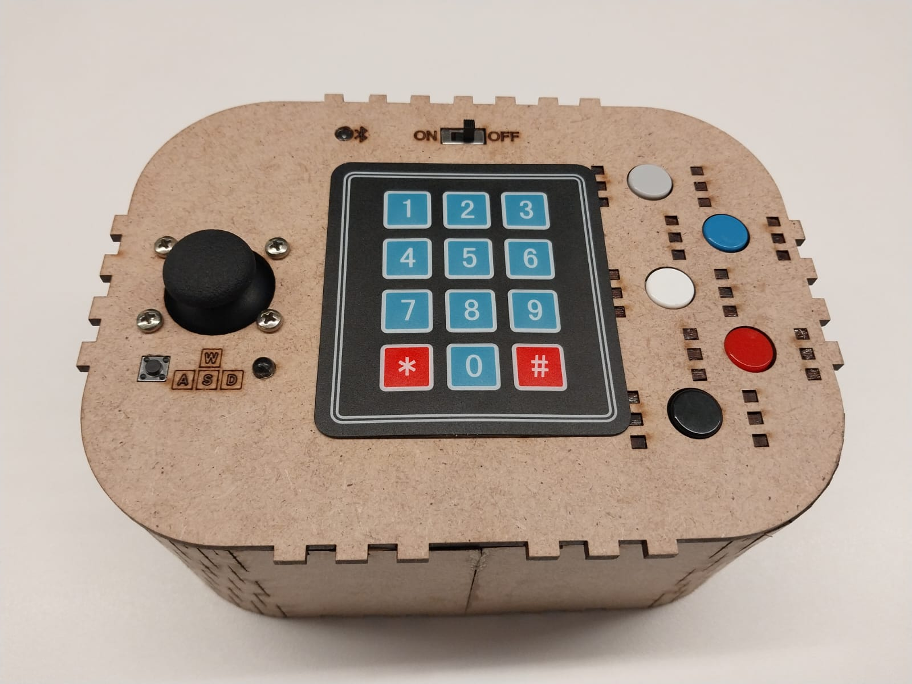
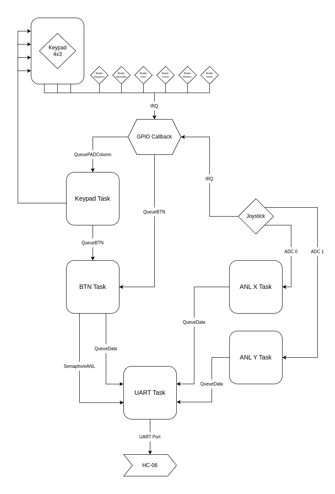

# Controle para o jogo *Don't Starve*

[*Don't Starve*](https://store.steampowered.com/app/219740/Dont_Starve/?l=portuguese) é um jogo de sobrevivência e exploração hardcore em que você precisa sobreviver em um local desconhecido, coletando recursos, criando itens e se defendendo de criaturas.

### Sobre o Projeto

O projeto se trata de um prototipar um controle *Bluetooth* mais simples que o normal e que, ainda sim, permita uma experiência completa do jogo.

O controle foi desenvolvido e prototipado para a APS 2 da disciplina *Computação Embarcada* Insper 2024.1. O enunciado da tarefa está disponível nesse [link](https://insper-embarcados.github.io/site/aps/aps-2-controle/).

### Funcionalidades do Controle
- `Joystick`: controla o mouse ou movimentação no jogo [ WASD ]
- `Botão Pequeno`: troca a função do *joystick* entre *mouse* e *WASD* 
- `Botão do Joystick`: Botão esquerdo do mouse
- `Botão Azul`: Coletar [ Space ]
- `Botão Azul`: Atacar [ F ]
- `Botão Cinza`: Cancelar [ Esc ]
- `Botão Branco`: Confirmar [ Enter ]
- `Botão Preto`: Botão direito do mouse

#### [Vídeo Demonstrativo](https://www.youtube.com/watch?v=-XfZkNZ6zs0)

### Desenvolvimento e Prototipação

O código do controle foi desenvolvido utilizando a *Linguagem C* fazendo uso de RTOS, tasks, queues e semaphores seguindo o diagrama abaixo.

Após receber e filtrar os inputs dos botões e analógicos, o dados são trasmitidos para o computador por meio da conexão *Bluetooth*.

Para realizar a interpretação dos dados recebidos pelo controle, foi desenvolvido um [código em *python*](./python/main.py) que decodifica a informação e a utiliza para emular os botões do jogo usando a biblioteca *python-uinput*.

O protótipo físico foi construido utilizando os seguintes componentes e materiais:
- 1 *Raspberry Pi Pico*;
- 1 Módulo Bluetooth HC-06
- 1 LED Branco;
- 1 LED RGB;
- 6 botões *push up* coloridos simples;
- 1 Joystick
- 1 Teclado com 12 botões;
- 1 Resistor de 330 $\Omega$;
- 1 Resistor de 470 $\Omega$;
- 1 Bateria LiPO de 530 mAh;
- 1 Switch on/off;
- Jumpers e fios rígidos;
- MDF 3mm.

### Utilizando o Controle

Para conectar o *Bluetooth* execute no terminal o comando:
    
    sudo rfcomm connect /dev/rfcomm0 98:DA:60:02:7E:DC

Em seguida, execute o código *python* para interpretar as informações vindas do controle utilizando o comando:

    sudo python3 ./python/main.py

### Critérios Avaliativos
- [x] C : Desenvolver um controle bluetooth para um jogo espefícico com protótipo mecânico customizado, sequindo os critérios disponíveis na rubrica;
- [x] C+: Apresentar um protótipo físico completo e funcional do controle;
- [x] B : Organizar o código em arquivos .c e .h separando o código em funções para organização;
- [x] B+: Utiliza algum componente não visto em sala (keypad);
- [x] A : Jogo escolhido é completamente jogável com o controle;  
- [ ] A+: 

### Desenvolvedores

- Carlos Eduardo Porciuncula Yamada
- Rafael Dourado Bastos de Oliveira
